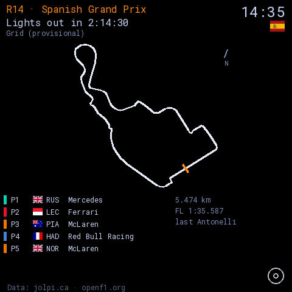
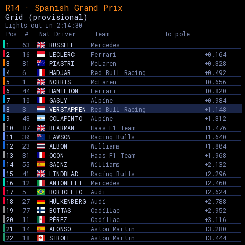
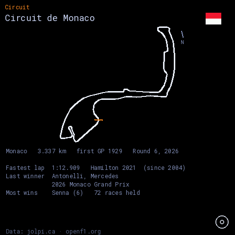
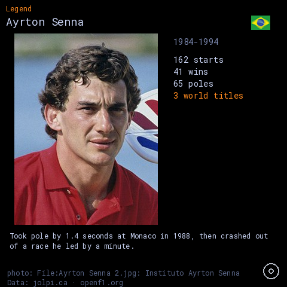

# F1 Tracker

**A Formula 1 season on a 480×480 touchscreen.**
Made for ESPHome · Guition ESP32-4848S040

<br clear="left">

---

On a **race weekend** it shows the circuit map for that weekend's track and the
drivers in starting order, each with the flag of their nationality, under a
header carrying the circuit's country flag.

The rest of the year it rotates through three kinds of card — the map and facts
of **every circuit**, a profile of **every current driver**, and an **F1 legend**
— with portraits, career records and a line on why they matter.

It watches one driver (**Max Verstappen** by default) and tells you when they're
racing, where they start and how they finished. On a driver's birthday their
card is badged in gold and shown nine times more often than usual.

| | |
|:--:|:--:|
|  |  |
| Race day — map, state line, top five | The grid, 22 rows with flags and team colours |
|  |  |
| A circuit card with its facts | A legend, with portrait and career |

More in [`docs/renders/`](docs/renders/) — every page is rendered from
the real compiled data, not drawn.

## Install

**From a browser.** Plug the board in over USB and open
**[akcoder.github.io/f1-tracker](https://akcoder.github.io/f1-tracker/)**.
Chrome or Edge on a desktop; Web Serial isn't available in Safari or on a phone.

Wi-Fi is set up afterwards over **Bluetooth or USB** — no credentials are
compiled in, and none are needed to install.

**Or adopt it in ESPHome.** The configuration is open and builds unmodified:

```
github://akcoder/f1-tracker/f1-tracker.yaml@main
```

**Updates** are published to this repo's Pages site. The device checks hourly,
and there's a *Check for updates* button on the settings screen. Nothing is
installed without being asked.

## Hardware

| | |
|---|---|
| Board | Guition ESP32-4848S040 |
| MCU | ESP32-S3, 16 MB flash, 8 MB octal PSRAM |
| Display | 4.0″ 480×480 IPS, ST7701S, 16-bit parallel RGB |
| Touch | GT911 capacitive |

No modification, no extra parts. It's the same board as its two sibling
projects, `sky-tracker` and `plane-tracker`.

## Build from source

```bash
python3 -m venv .venv && .venv/bin/pip install esphome
cp secrets.yaml.example dev/secrets.yaml      # then fill it in
./deploy.sh                                   # validate, check, compile
```

`deploy.sh` is a gate, not a convenience. It fails on **any** compiler warning
in this project's own code, on a character that no loaded font can draw, and on
a render that has drifted from the firmware's actual geometry.

```bash
make -C tests                                 # 11,395 host checks
```

`f1-tracker.yaml` is the **public** config and contains no secrets, because a
published configuration has to build unmodified after adoption. Local
credentials live in `dev/f1-tracker-dev.yaml`, which pulls the public one in as
a package.

### Regenerating the compiled-in data

Everything the device shows is baked into the firmware, so the carousel works
with no network at all. All generators cache, so a rerun costs no API requests.

```bash
python3 tools/gen_circuits.py --all-circuits reference/samples/jolpica-all-circuits.json
python3 tools/gen_calendar.py      # season from /current/, never pinned
python3 tools/gen_drivers.py       # careers, with the pre-1994 pole guard
python3 tools/gen_flags.py
python3 tools/gen_facts.py         # fastest lap, last winner, most wins
python3 tools/gen_portraits.py     # Commons; fails on an unattributable image
python3 tools/gen_logo.py
python3 tools/render_pages.py --font /path/to/RobotoMono.ttf
```

| Asset | Size |
|---|---|
| 40 circuit traces | 19.2 kB |
| 48 country flags, two sizes | 28.1 kB |
| 23 driver + 32 legend profiles | ~12 kB |
| 48 portraits, 240×320 JPEG | 0.98 MB |
| Facts for 41 circuits | ~9 kB |

## Layout

| Path | Contents |
|---|---|
| [`REQUIREMENTS.md`](REQUIREMENTS.md) | **the design document** — 170 decisions, each with the measurement behind it |
| `f1-tracker.yaml` | the public ESPHome config |
| `dev/` | the local build, with secrets |
| `f1-tracker/` | C++ headers: state machine, data task, drawing, generated data |
| `tools/` | generators, and the renderers that check the layout |
| `tests/` | host tests — `make -C tests` |
| `docs/` | the Pages site: web installer, manifest, binaries |
| `reference/` | vendored circuit data, captured API fixtures, credits |

Most of the logic is deliberately free of LVGL so it builds and runs on a host —
the state machine, the parsers, the carousel, the alert latch and the
championship arithmetic are all tested without a board.

## Data

| Source | Used for | Licence |
|---|---|---|
| [jolpi.ca](https://jolpi.ca/) | calendar, drivers, results, standings | CC BY-NC-SA 4.0 |
| [openf1.org](https://openf1.org/) | session data | CC BY-NC-SA 4.0 |
| [f1-circuits](https://github.com/bacinger/f1-circuits) | circuit geometry | MIT |
| [flag-icons](https://github.com/lipis/flag-icons) | country flags | MIT |
| [Wikimedia Commons](https://commons.wikimedia.org/) | portraits | per image, credited on the card |

**Data: [jolpi.ca](https://jolpi.ca/) · [openf1.org](https://openf1.org/)** —
attribution is required by both licences and the device shows it.

> Live timing is a paid tier on OpenF1, and this project uses the free tiers
> only. The device computes OpenF1's live window and never requests inside it,
> so it's a season tracker and a race-weekend companion rather than a live
> timing screen. The race page counts down to lights out, then to the result.

## Licence

[MIT](LICENSE) for this project's code and configuration. The files generated
from Jolpica data carry **CC BY-NC-SA 4.0** instead — see
[`reference/CREDITS.md`](reference/CREDITS.md).

Not affiliated with, endorsed by, or connected to Formula 1. *F1*, *FORMULA 1*,
*FIA* and *GRAND PRIX* are trademarks of their respective owners. Personal,
non-commercial use.
